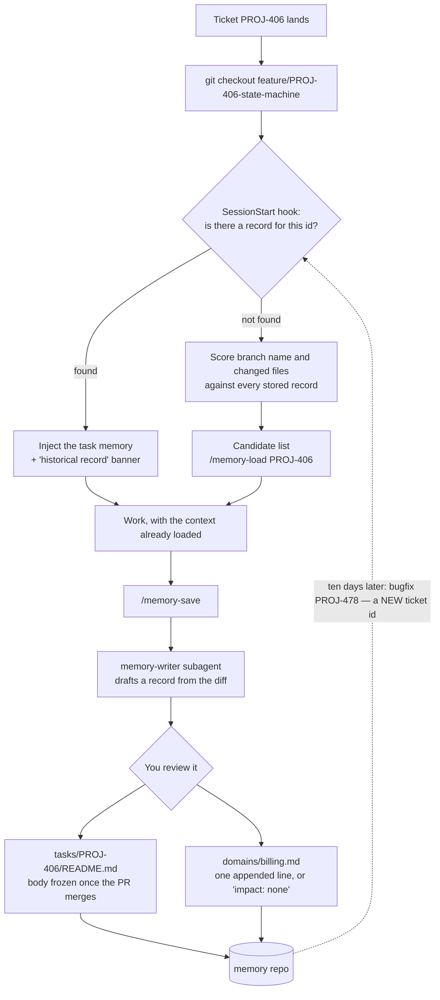

# task-memory

A Claude Code plugin that gives your team a memory keyed on ticket IDs.

You ship a feature. Ten days later a bugfix or a follow-up request lands on it, and you
spend the first twenty minutes of the session explaining the context to the AI all over
again — why it was built that way, what the trap was, what you deliberately left out.

This plugin stores that context once and loads it automatically. When you check out
`feature/PROJ-406-...` and start Claude Code, the memory for `PROJ-406` is already in
context. You typed nothing.

```
$ git checkout feature/PROJ-406-state-machine
$ claude

<task-memory>
## Task memory: PROJ-406

> HISTORICAL RECORD. This file describes the system as it was when written...

The handler *looks* idempotent but is not: replaying the same event emits a
second notification. Callers must deduplicate on event id.
...
```

> **Status: early.** It works, but it has been used by one team for a short time. The
> design notes below are honest about what is unproven.

---

## The loop



The dotted edge is the whole point. The loop closes on a **different** ticket id than
the one that opened it, which is why exact-id lookup alone is not enough.

---

## The part that actually matters

Exact ticket-ID matching solves the easy case and fails the important one. **A bugfix
gets a new ticket ID.** `PROJ-478` is the bug in the thing you built as `PROJ-406`, and
an exact-match lookup returns nothing precisely when you need it most.

So when there is no exact match, the plugin scores every stored record against your
branch name and the files you changed, and shows you the candidates:

```
## No memory stored for PROJ-478 (likely a new task or a bugfix).

Candidate records matched on branch name and changed files:

  - billing [domain] How invoice reconciliation works today -> domains/billing.md  (score 16)
  - PROJ-406 [task] Subscription state transitions centralised -> tasks/PROJ-406/README.md  (score 14)

Open a relevant one with: /memory-load <TASK-ID>
```

The strongest signal is a stored `anchors[].path` matching a file you actually touched.
That is a far better retrieval key than a ticket number.

---

## Two layers, on purpose

| | `tasks/<ID>/README.md` | `domains/<name>.md` |
| --- | --- | --- |
| Answers | "What happened in PROJ-406 and why?" | "How does this behave *today*?" |
| Lifetime | Body frozen once the PR merges | Grows forever, append-only |
| Truth | Historical record | Expected to be current |

With one layer you get this: PROJ-406 builds the workflow, PROJ-451 adds a state,
PROJ-478 fixes a bug in it. Six months later the answer to "how does this work" is
spread across three directories and none of them is correct on its own.

So finishing a task asks a mandatory question: *did this produce knowledge that
outlives the task?* If yes, one line is appended to the domain file. If no, you say
"domain impact: none" out loud. It is never skipped silently.

---

## Install

**1. Create your memory repository.** It is a separate git repo — the plugin directory
is wiped on every update, so data must not live there.

```bash
git clone https://github.com/mesutpiskin/claude-task-memory /tmp/ctm
cp -r /tmp/ctm/templates/memory-store ~/task-memory-store
cd ~/task-memory-store && git init && git add -A && git commit -m "init memory store"
```

Push it somewhere your team can reach, then everyone clones it. If you put it anywhere
other than `~/task-memory-store`, set `TASK_MEMORY_DIR` in your shell profile:

```bash
export TASK_MEMORY_DIR="$HOME/your/path"
```

**2. Install the plugin.** In Claude Code:

```
/plugin marketplace add https://github.com/mesutpiskin/claude-task-memory
/plugin install task-memory@task-memory
```

**3. Verify.** Check out a branch with a ticket ID in the name and start a session.
You should see a `<task-memory>` block. If you do not: check `TASK_MEMORY_DIR`, check
that the memory directory is really a git repo, and check `/hooks`.

Requirements: git, bash, python3. PyYAML is used if present but is not required.

---

## Use

| | |
| --- | --- |
| Starting new work | Nothing. If the branch has a ticket ID, memory loads itself. |
| Coming back to old work | `/memory-load PROJ-406`, or pick from the suggestions the hook printed. |
| Finishing work | `/memory-save` — drafts a record, you review it, it commits. |
| Asking a question | Just ask. "What should I watch out for in billing?" triggers the skill. |

`/memory-save` runs a subagent in its own context window, so drafting does not eat your
main session. It never commits on its own and never sets `confidence: reviewed` — only
a human who actually read the text can do that.

---

## What goes in, what stays out

One rule decides whether this is valuable or landfill:

> **Never write anything that can be re-derived from the code, git, the issue tracker
> or the PR.**

| Do not write | Write |
| --- | --- |
| List of changed files | Why this approach, and why the alternative lost |
| Class / method dumps | Business rules that are invisible in the code |
| Commit message summaries | Traps: "this looks idempotent but is not" |
| Copies of the ticket description | Implicit dependencies: "another team reads this column" |
| "I added method X" | Gaps left on purpose, and why |

Sanity check: if you deleted a sentence and twenty minutes of reading code would bring
it back, do not write it. If somebody would have to *tell* you, write it.

**Never write** tokens, passwords, connection strings, internal hostnames, customer
names or personal data. A secret scanner as a pre-commit hook on the memory repo is a
good idea.

---

## Design notes, including what is unproven

**Memory is a historical record, not a source of truth.** Every injected task memory
carries a banner saying so, and the rule "if the memory and the code disagree, the code
is right" is repeated in the skill, the agent and the commands. Stale memory that
presents itself as current is worse than no memory at all.

**`confidence: ai_generated` vs `reviewed`** is the only defence against a wrong AI
summary being treated as fact a year later. Inflating that field destroys the value of
the whole system. It is a social contract the tooling cannot enforce — the largest open
risk in the design.

**`anchors[].verified_at` is per anchor**, not per record, because a workspace can span
several repositories and two repositories never share a commit SHA.

**`INDEX.md` is generated and gitignored.** Committing it would give every developer a
permanent merge conflict on one file.

**Domain files are append-only.** Two people touching the same domain in the same week
then conflict at the line level instead of the paragraph level. The cost is that domain
files bloat and need a periodic human consolidation pass — budget roughly 30 minutes a
month, rotated.

**`config.env` is parsed, never sourced.** The memory repo is writable by the whole
team; `source`-ing a file from it would turn any commit there into code execution on
every developer's machine.

**Unproven:** whether people keep writing memories once the novelty wears off. Nothing
in the design forces it. The one metric worth tracking is simple — when you came back
to old work, did you have to re-explain the context? If yes, the record was missing
something; go add it.

---

## Configuration

Optional `config.env` in the root of your memory repository:

```bash
TASK_ID_PATTERN='[A-Z][A-Z0-9]+-[0-9]+'   # how to find a ticket ID in a branch name
BASE_BRANCHES='main master develop'       # diff targets, in priority order
EXTRA_STOP_WORDS='acme widgets'           # tokens too common to carry signal
```

`EXTRA_STOP_WORDS` matters more than it looks. If your company name appears in every
package path, it matches everything and therefore ranks nothing.

---

## Layout

```
.claude-plugin/          plugin.json, marketplace.json
skills/task-memory/      when and how to read and write memory
agents/memory-writer.md  drafts a record from the branch diff, in its own context
commands/                /memory-load, /memory-save
hooks/hooks.json         SessionStart
scripts/                 session_start.sh, build_index.py
templates/               task record template + a memory-store scaffold
```

## Contributing

Bug reports and PRs welcome — see [CONTRIBUTING.md](CONTRIBUTING.md). The most useful
contribution right now is a report of where the retrieval heuristic fails on a real
codebase.

## License

MIT
